# ai-swagger-to-playwright-generator

Ferramenta de IA aplicada a QA que gera uma suíte completa de testes de contrato em Playwright a partir de **apenas uma URL de Swagger/OpenAPI**.

## Objetivo principal

Ajudar squads de QA de uma empresa a automatizar testes de contrato de API sem precisar escrever a suíte do zero: qualquer time informa a URL do Swagger do próprio projeto e recebe de volta uma suíte pronta, no padrão usado no restante do portfólio (`playwright-public-api-contract-tests`) — testes por recurso/método/status, fixtures de schema, utilitários reutilizáveis e CI/CD. Isso padroniza a forma como as squads testam contrato de API, reduz o tempo de setup de um projeto novo de dias para minutos, e libera o QA para focar em cenários que a IA não cobre (exploratório, performance, segurança).

## Dinâmica de funcionamento

1. O QA informa a URL do Swagger da API do seu projeto (ex: `https://api-do-time-x.empresa.com/api-docs.json`).
2. O gerador busca essa especificação em tempo real — nunca um arquivo estático que pode ficar desatualizado.
3. Uma IA (LLM) lê a especificação e escreve a suíte completa, seguindo regras fixas definidas numa skill (ver seção abaixo).
4. Os arquivos são gravados em disco, prontos para rodar.
5. **A partir daqui, a IA sai de cena.** A suíte gerada é código Playwright comum — roda local ou em qualquer pipeline de CI/CD, sem custo recorrente de IA e sem depender de chave de API.

```
URL do Swagger  →  IA gera a suíte (uma vez)  →  npx playwright test (sempre, sem IA)
```

## Uso de IA — LLM e demais componentes

| Componente | Função |
|---|---|
| **LLM** | O motor que efetivamente lê a especificação e escreve o código. Gemini por padrão (gratuito), Claude como alternativa paga — troca por uma variável de ambiente, sem mudar código (`generator/llm_client.js`). |
| **Skill** | Um arquivo de instruções (`skills/gerar-suite-playwright.md`) que define exatamente como a suíte deve ser gerada: estrutura de pastas, nomenclatura, cobertura de status HTTP, contrato de erro da API alvo. É o que garante consistência entre gerações — sem ela, cada chamada à IA produziria um resultado diferente. |
| **Prompt Registry** | Registro (`generator/prompt_registry/`) de cada geração feita: qual Swagger foi usado, qual skill, quantos arquivos saíram, sucesso ou falha. Permite auditar o que a IA gerou e quando, e outros QAs reaproveitarem gerações já validadas. |
| **MCP (Model Context Protocol)** | Protocolo que conecta a IA a sistemas externos reais. Usado aqui em `generator/mcp_integration/github_pr.js`: em vez de a IA commitar direto na branch principal, ela pode abrir um **Pull Request** com a suíte gerada — garantindo revisão humana antes do merge, prática essencial para código gerado por IA. |

## Como usar — passo a passo

### Pré-requisitos
- Node.js 20 ou superior instalado
- Uma chave gratuita do Gemini em [aistudio.google.com/apikey](https://aistudio.google.com/apikey)
- Dois terminais abertos (um para a API alvo, outro para o gerador) — a API precisa ficar rodando enquanto o gerador trabalha

### Terminal 1 — subir a API a ser testada

```bash
cd target_api
npm install
npm start
```

Saída esperada:
```
target_api rodando em http://localhost:3000
Swagger UI disponível em http://localhost:3000/api-docs
```

Deixe esse terminal aberto e rodando — não feche.

### Terminal 2 (NOVO — abra um segundo terminal, sem fechar o Terminal 1) — configurar e rodar o gerador

⚠️ O Terminal 1 precisa continuar aberto e rodando a `target_api`. Abra um terminal **adicional** (no VS Code: ícone `+` no painel do terminal) para os comandos abaixo — nunca reaproveite o Terminal 1 para isso.

```bash
cd generator
npm install
```

Configure a chave (Windows PowerShell):
```bash
$env:GEMINI_API_KEY="sua-chave-aqui"
```

Gere a suíte, informando a URL do Swagger:
```bash
node generate.js http://localhost:3000/api-docs.json ../generated-suite
```

Saída esperada (uma linha por etapa: utils, arquivos de projeto, e um por recurso):
```
1/4 - Buscando especificação Swagger em: ...
2/9 - Gerando utils e config compartilhados...
3/9 - Gerando arquivos de projeto...
4/9 - Gerando testes do recurso "auth"...
...
Concluído.
```

### Rodar a suíte gerada — sem IA a partir daqui

```bash
cd ../generated-suite
npm install
npx playwright test
```

Saída esperada:
```
Running 48 tests using 4 workers
  48 passed
```

Para ver o relatório visual:
```bash
npx playwright show-report
```

### Se o modelo padrão estiver com cota esgotada
O plano gratuito do Gemini limita requisições por dia por modelo. Se aparecer erro de "quota exceeded", troque para um modelo com cota maior antes de gerar de novo:
```bash
$env:GEN_MODEL="gemini-3.5-flash-lite"
node generate.js http://localhost:3000/api-docs.json ../generated-suite
```

## Arquitetura

```
ai-swagger-to-playwright-generator/
├── target_api/                 API de demonstração: 6 recursos, Swagger real
├── skills/
│   └── gerar-suite-playwright.md   Regras de geração (formato, cobertura, contrato de erro)
├── generator/
│   ├── generate.js              Orquestra: busca Swagger → aciona IA → grava suíte
│   ├── fetch_swagger.js         Busca a especificação (URL ou arquivo local)
│   ├── llm_client.js            Cliente único de LLM (Gemini padrão / Claude opcional)
│   ├── prompt_registry/         Auditoria de cada geração
│   └── mcp_integration/         Abre Pull Request no GitHub com a suíte gerada
└── .github/workflows/ci.yml     Valida o gerador e a target_api a cada push
```

## Escala de demonstração

A `target_api` cobre 6 recursos (`users`, `products`, `orders`, `categories`, `reviews`, `auth`), múltiplos verbos e status por endpoint — gera cerca de **48-51 cenários de teste**, testados e confirmados **48/48 passando**.

## Alternar entre Gemini (gratuito) e Claude (pago)

```bash
npm install @anthropic-ai/sdk
set LLM_PROVIDER=anthropic
set ANTHROPIC_API_KEY=sua-chave-aqui
```

## Roadmap

| Fase | Entregável |
|---|---|
| 1 — Núcleo | Gerador funcional: Swagger → suíte Playwright completa *(concluído)* |
| 2 | Relatório Allure integrado por padrão |
| 3 | Integração via protocolo MCP completo com o GitHub (hoje via REST API) |
| 4 | Interface web: colar a URL do Swagger, baixar a suíte em .zip |

## Solução de problemas conhecidos

**"Cannot find module" após gerar uma suíte nova:** o modelo gratuito pode nomear/localizar o utilitário de validação de schema de forma diferente entre execuções (ex: `utils/schemaValidator.js` vs `src/utils/validators.js`). Se isso acontecer, confirme se o caminho importado nos arquivos `.spec.js` corresponde a um arquivo que realmente existe em `src/utils/` ou `utils/`; se não existir, crie o arquivo faltante com a função esperada, ou gere a suíte novamente.

**"quota exceeded" ao gerar:** veja a seção "Se o modelo padrão estiver com cota esgotada" acima.

**Testes assumindo um registro fixo (ex: `id=1`) que falha por não existir:** ocorre quando outro teste, rodando em paralelo, já alterou ou removeu esse registro. A correção é o teste criar seu próprio registro via `POST` no início, em vez de depender de um ID fixo.

## Stack

Node.js 20+, Playwright, Ajv/Zod (validação de schema), Gemini API (padrão) / Anthropic API (opcional), GitHub Actions.

## Evidências de execução

**1. `target_api` rodando, com Swagger UI disponível:**

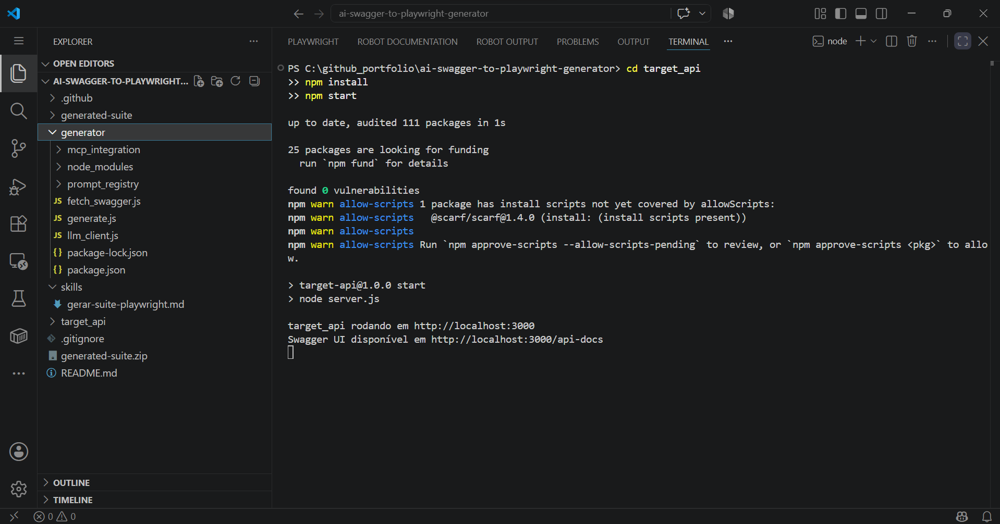

**2. Swagger UI real, no navegador:**

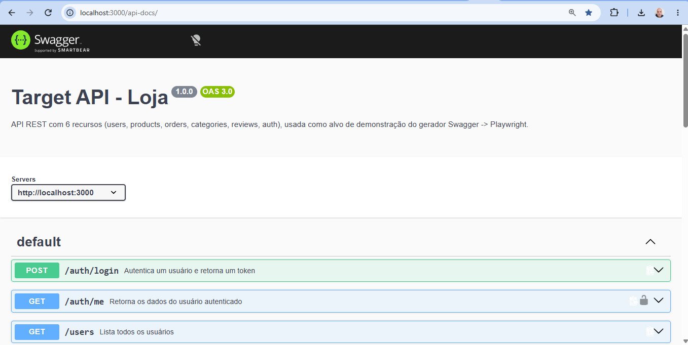

**3. Swagger UI — lista completa de endpoints dos 6 recursos:**

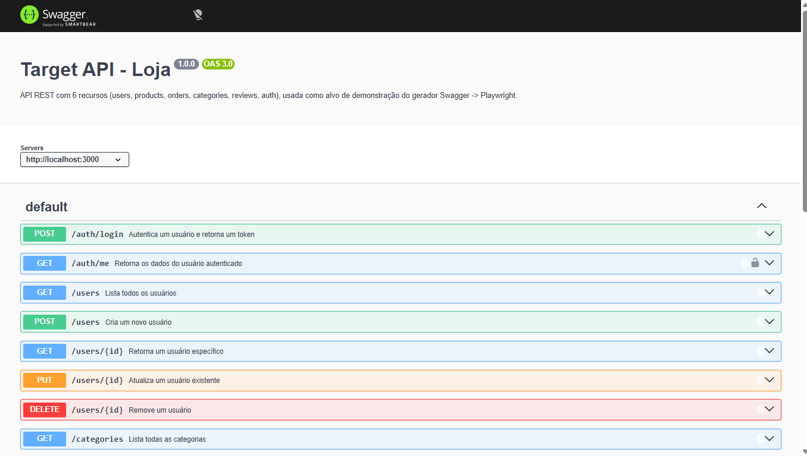

**4. Instalação das dependências do gerador:**

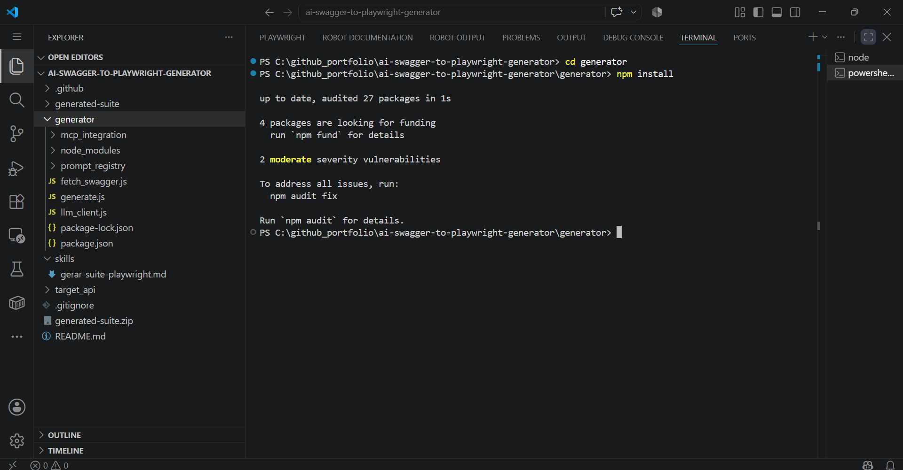

**5. Execução completa do gerador — Swagger → suíte gerada pela IA:**

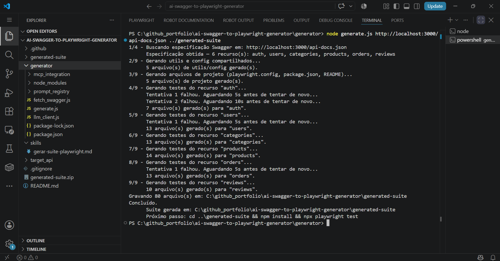

**6. Instalação das dependências da suíte gerada:**

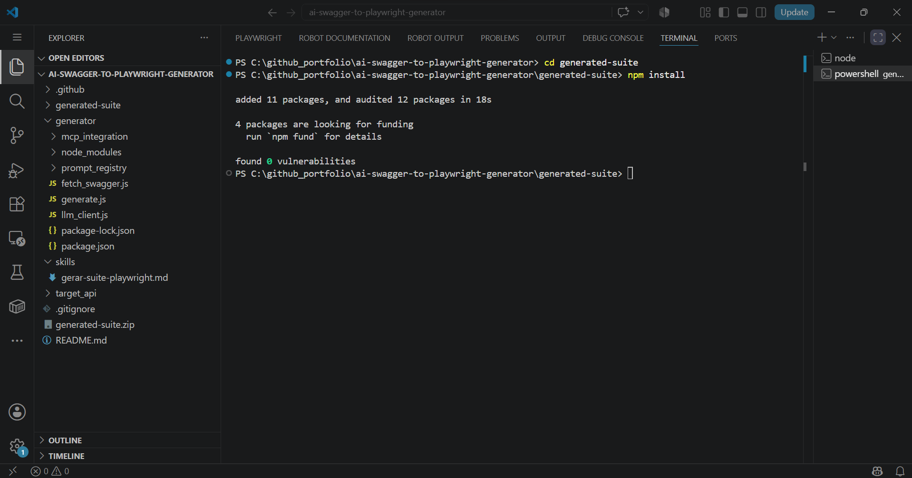

**7. Execução da suíte de testes — 48 aprovados:**

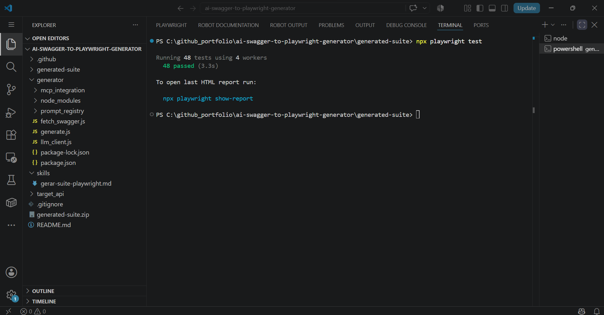

**8. Servidor do relatório Playwright sendo iniciado:**

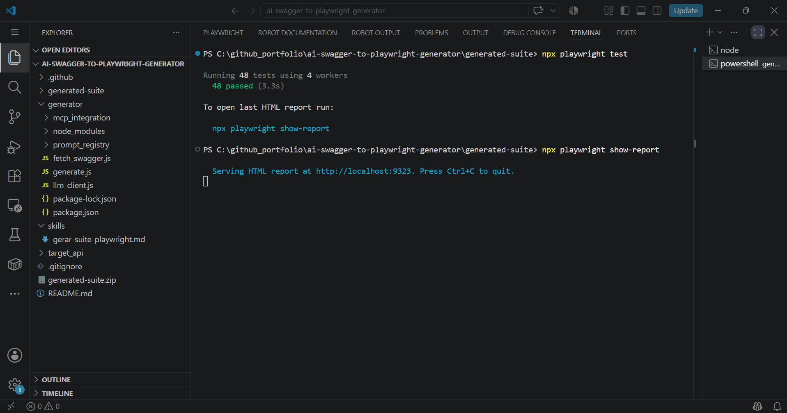

**9. Relatório visual — filtro "Passed", 48/48:**

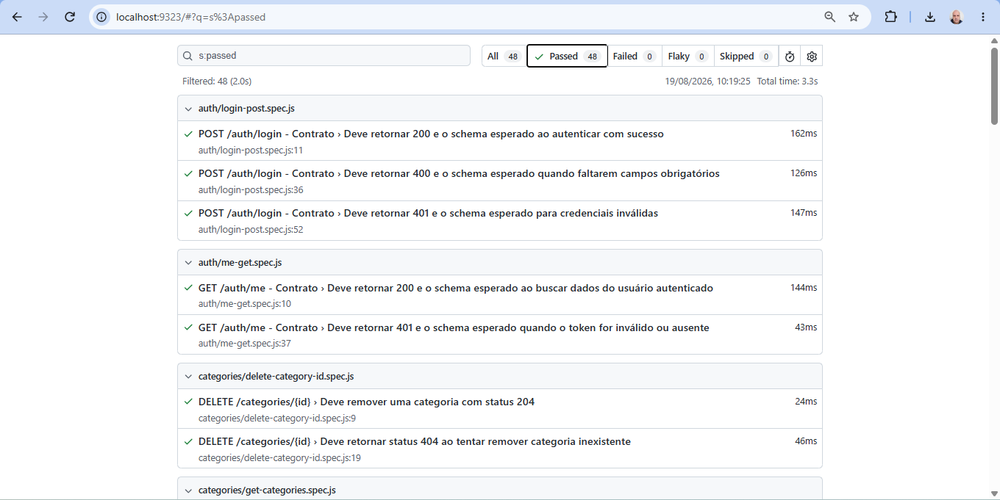

**10. Relatório visual completo — All 48, Failed 0, Flaky 0, Skipped 0:**

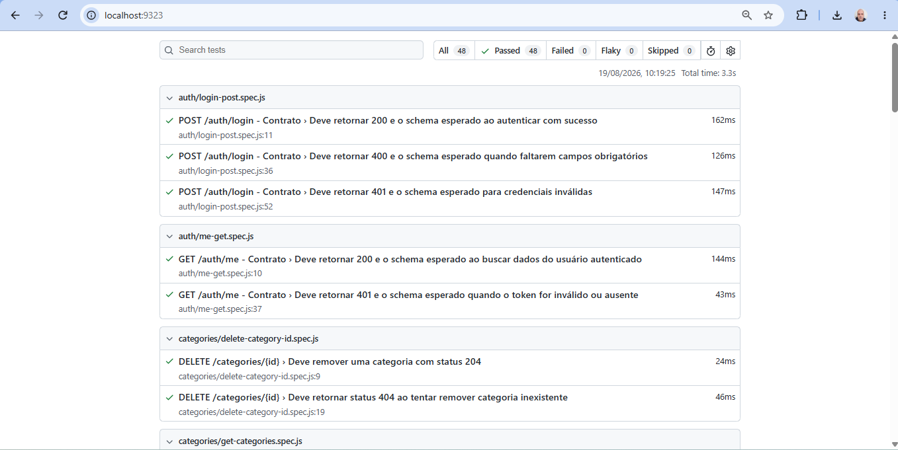

**11. Estrutura de pastas da suíte gerada, no VS Code:**

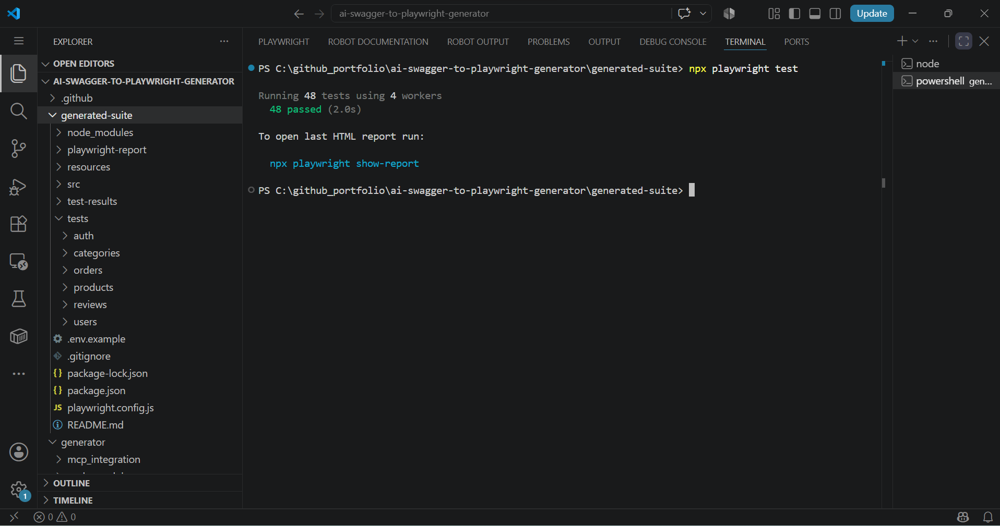
